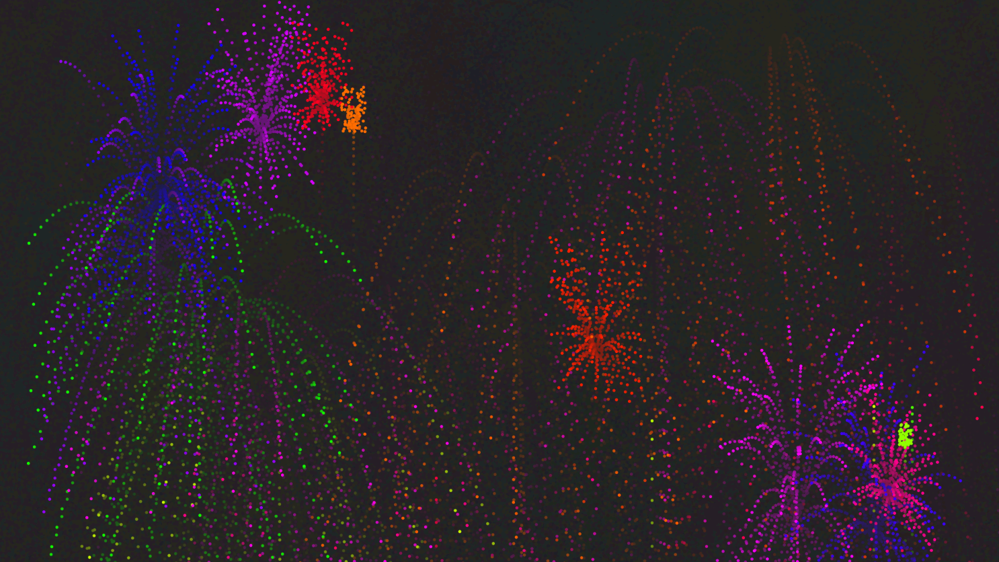

# js-fireworks
This is a paricle simulation of fireworks I built using <a href="https://p5js.org/">p5.js</a>.
## URL
This proyect is hosted by github pages at <a href="https://pabloqb2000.github.io/js-fireworks/">this link</a>.
## Controls
Simply click / dragg your mouse arround the canvas
## Screenshot
</img>
## References
To find more information about the <b>awesome</b> library used for this proyect visit:
<a href="https://p5js.org/"> https://p5js.org/ </a>
